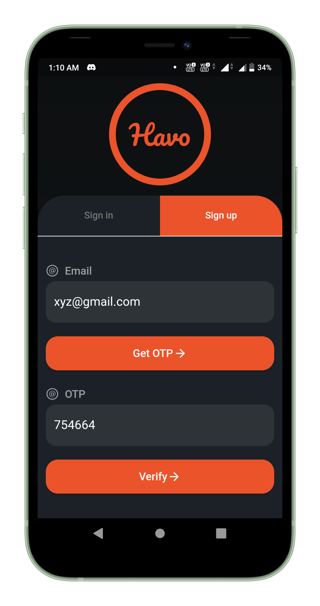
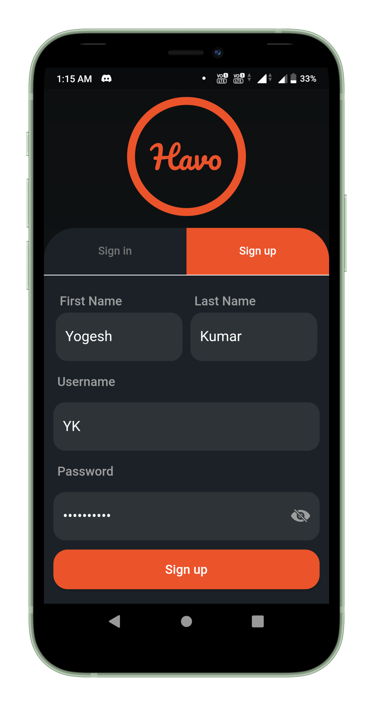
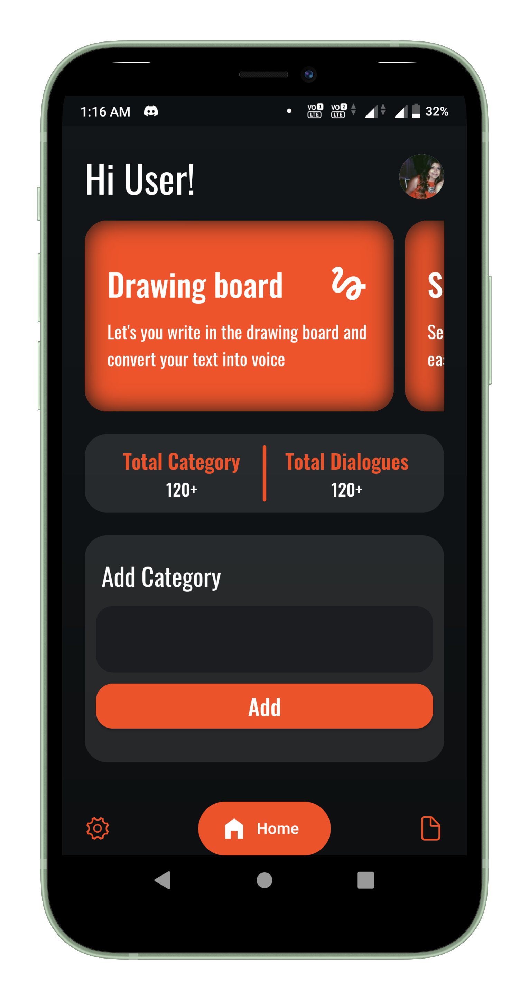
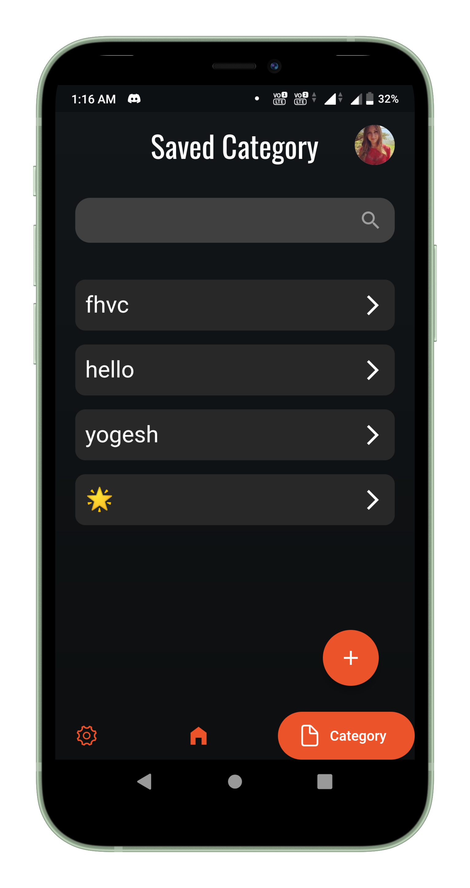
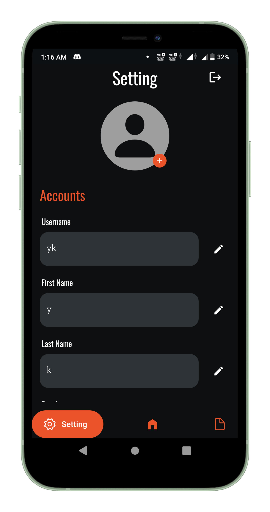
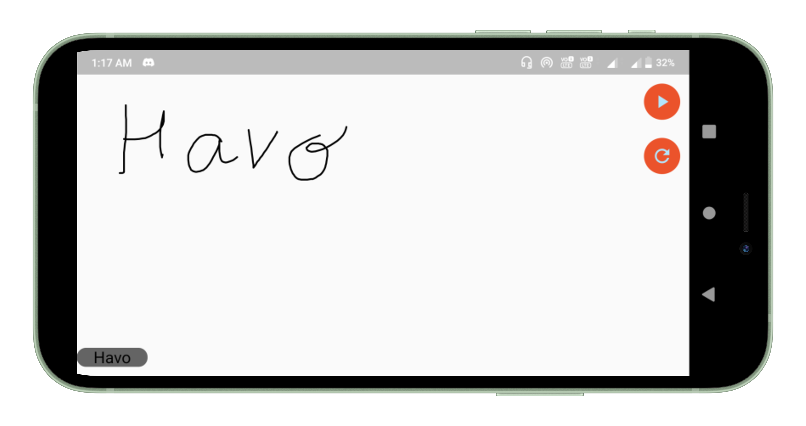

<p align="center"></p>
<h1 align="center">Havo</h1>
<p align="center"></p>

## Getting Started

A mobile application used to convert handwriting to speech via Machine Learning. It uses the same technology that powers handwriting recognition in Gboard, Google Translate, and the Quick, Draw! game. This application is for the people who are unable to speak, by helping them save their daily conversation in the form of phrases. It provides additional authentication feature to help the user secure their data and can be logged in from multiple devices<br>

### APK

[⬇️ Download apk here](https://github.com/200-DevelopersFound/Havo/blob/main/apk/app.apk?raw=true)

### Backend API

This applcation uses Express server hosted at Heroku

[🔥 Live Version](https://havobackend.herokuapp.com)

[:star: Github Repository](https://github.com/200-DevelopersFound/Havo-Backend)

## Some Features

- Convert your handwriting to speech and text via machine learning
- Save your daily conversation in the form of categories and dialogues
- Fully secured application via JWT Token
- Login from multiple mobile devices at the same time

### Show some :heart: and :star: the repo to support the project.

## Screenshots

### Mobile

 
 
 

## 👍 Contribution

1. Fork it
2. Create your feature branch (git checkout -b my-new-feature)
3. Commit your changes (git commit -m 'Add some feature')
4. Push to the branch (git push origin my-new-feature)
5. Create new Pull Request and rebase it with main

### What can you contribute

1. Add some more cool features.
2. Find bugs or errors and fix it.
3. Improve UI/UX designs.

## Project setup

**Step 1:**

Download or clone this repo by using the link below:

```
https://github.com/200-DevelopersFound/Handwriter.git
```

**Step 2:**

Go to project root and execute the following command in console to get the required dependencies:

```
flutter pub get
```

**Step 3:**

Run the project in Android Studio or any IDE you prefer or run the command:

```
flutter run <DART_FILE> or Run the project in android studio
```

**Step 4:**

To build the flutter project:

```
flutter build
```

### Dependencies :innocent:

This project is uses

- provider: ^5.0.0
- learning_input_image: ^0.0.5
- learning_digital_ink_recognition: ^0.0.1
- flutter_circle_color_picker: ^0.3.0
- flutter_tts: ^3.3.3
- cupertino_icons: ^1.0.4
- loading_indicator: ^3.0.2
- progress_loading_button: ^1.1.4
- google_fonts: ^2.1.1
- google_nav_bar: ^5.0.5

## Facing Any Problem or need any Help:grey_question:

Incase you face any problem or need any help write me in [issues](https://github.com/200-DevelopersFound/Havo/issues) section.
